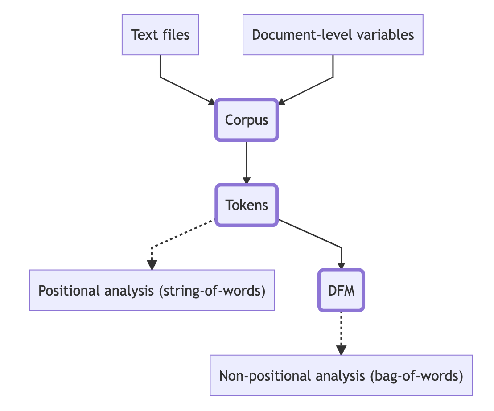

```{r setup, include=FALSE}
knitr::opts_chunk$set(echo = TRUE)
```

# Quanteda Chapter 3: Quanteda Objects

There are 3 main types of objects in Quanteda, each of which has advantages and disadvantages.

-   Corpus: a dataframe with character strings and variables. The idea behind this object is to combine text with document-level variables

-   Tokens: A list of vectors containing tokens. This type of object holds information more efficiently than strings, but still retains positional data. This is useful for more advanced text analysis that utilizes the position of words.

-   Document-feature matrix (DFM): Matrix holding the frequencies of features (this could be words, or n-grams depending on the type of analysis). This method of storage is the most efficient, but loses positional data. Bag-of-words/nonpositional analysis is usually done with this type of object.



Dependencies for this chapter:

```{r}
require(quanteda)
require(readtext)
require(quanteda.textstats)
options(width = 110)
```

## Corpus

### Constructing a Corpus

You can create a corpus from:

-   character vector (one document per element)

-   dataframe of 2 character vectors: one for the documents, and the other for document level variables

-   VCorpus or SimpleCorpus object (from tm package)

**Example 1: From character vector**

```{r}
corp_immig <- corpus(data_char_ukimmig2010, 
                     docvars = data.frame(party = names(data_char_ukimmig2010))) #note how docvars are defined separately
print(corp_immig)
```

```{r}
summary(corp_immig)
```

**Example 2: From dataframe**

```{r}
# set path
path_data <- system.file("extdata/", package = "readtext")

# import csv file
dat_inaug <- read.csv(paste0(path_data, "/csv/inaugCorpus.csv"))

#get document level variable names (provided by the CSV)
names(dat_inaug)
```

```{r}
#create the corpus
corp_inaug <- corpus(dat_inaug, text_field = "texts")
print(corp_inaug)
```

```{r}
#get a summary of the corpus
summary(corp_inaug, 5)
```

You can also change the names of the document level variables using docnames():

```{r}
docid <- paste(dat_inaug$Year, 
               dat_inaug$FirstName, 
               dat_inaug$President, sep = " ")
docnames(corp_inaug) <- docid
print(corp_inaug)
```

```{r}
summary(corp_inaug, 5)
```

**Example 3: From Vcorpus**

Vcorpus is an object from the tm package, which allows users to complete text mining. Quanteda is built on top the tm package.

```{r}
corp_tm <- tm::VCorpus(tm::VectorSource(data_char_ukimmig2010))
corp_quanteda <- corpus(corp_tm)
```

```{r}
summary(corp_tm, 5)
```

### Document Level Variables

To access the document level variables of a corpus, using the function docvars().

```{r}
corp <- data_corpus_inaugural
head(docvars(corp))
```

To get a specific document level variable, you have two options:

```{r}
#using docvars
docvars(corp, field = "Year")
```

```{r}
#more similar to R dataframe syntax
corp$Year
```

To update document level variables, you have very similar options:

```{r}
docvars(corp, field = "Century") <- floor(docvars(corp, field = "Year") / 100) + 1
head(docvars(corp))
#this appends to the end
```

```{r}
corp$Century <- floor(corp$Year / 100) + 1
head(docvars(corp))
```

Also note that the docvars function is also available for tokens and dfms, and it works in the same way.

### Subsetting a Corpus

To select documents out of a corpus, you must subset a corpus. First, find the number of documents (this is very similar to the number of observations in a dataset):

```{r}
corp <- data_corpus_inaugural
ndoc(corp)
```

To subset, use the function corpus_subset. The function takes in the corpus, and a boolean expression and outputs another corpus:

```{r}
corp_recent <- corpus_subset(corp, Year >= 1990)
ndoc(corp_recent)
```

```{r}
corp_dem <- corpus_subset(corp, President %in% c("Obama", "Clinton", "Carter"))
ndoc(corp_dem)
```

### Units of Text

A unit of text is the level of granurality at which text data is stored. When creating a corpus, we often start with documents as the unit of text. However, we may also look at the paragraph and sentence levels of text (note that changes of unit in text are completely reversible).

To change the corpus shape, we use corpus_reshape that takes in a corpus and unit of text to output a corpus.

```{r}
#change to sentence level
corp_sent <- corpus_reshape(corp, to = "sentences")
print(corp_sent)
```

```{r}
#convert back to documents
corp_doc <- corpus_reshape(corp_sent, to = "documents")
print(corp_doc)
```

### Text Tags

Text tags are sections of text. Text tags can be used to identify sections of a document that you would like to analyze, such as a header, introduction, or speaker.

To utilize text tags, you must identify a set of tags of interest. The function corpus_segment allows you the split a document using the identified tags.

```{r}
#document sections
corp_tagged <- corpus(c("##INTRO This is the introduction.
                         ##DOC1 This is the first document.  Second sentence in Doc 1.
                         ##DOC3 Third document starts here.  End of third document.",
                        "##INTRO Document ##NUMBER Two starts before ##NUMBER Three."))
corp_sect <- corpus_segment(corp_tagged, pattern = "##*")

cbind(docvars(corp_sect), text = as.character(corp_sect))
```

## Tokens

### Construct Tokens Object

Tokens are constructed from Corpus objects.

```{r}
corp_immig <- corpus(data_char_ukimmig2010)
toks_immig <- tokens(corp_immig)
head(toks_immig)
```

In the process of creating tokens, you may remove certain characters. By default, the tokens() function removes separators like white spaces, but it can also be set to remove things like punctuation or numbers. This is denoted using parameters.

```{r}
toks_nopunct <- tokens(data_char_ukimmig2010, remove_punct = TRUE)
print(toks_nopunct)
```

### Keywords in context

The advantage to tokens is that they allow you to look at the relative position of words. To view keywords (that you identify) in context, you can use the kwic() function.

Note that using the \* format, you can get more words that start with/end with a certain set of characters.

```{r}
toks <- tokens(data_char_ukimmig2010)
kw_immig <- kwic(toks, pattern =  "immig*")
head(kw_immig, 10)
```

You have the option to define multiple keywords by providing a character vector to the pattern parameter, and also define a window of words around the keyword using the window parameter.

```{r}
kw_immig3 <- kwic(toks, pattern = c("immig*", "migra*"), window = 7)
head(kw_immig3, 10)
```

You may also use a phrase as a keyword using the phrase() function.

```{r}
kw_asylum <- kwic(toks, pattern = phrase("asylum seeker*"))
head(kw_asylum)
```

### Select Tokens

Token selection involves removing the words that are not of interest (this may be a bit counterintuitive!). Often, we like to remove function words/grammatical words, which are required for grammer but do not provide additional meaning. The stopwords() function provides a list of these words for different languages.

```{r}
toks <- tokens(data_char_ukimmig2010)
toks_nostop <- tokens_select(toks, pattern = stopwords("en"), selection = "remove")
#can also use tokens_remove, with no selection parameter
print(toks_nostop)
```

To avoid changing the length of the document (which is important for positional analysis), you can add padding.

```{r}
toks_nostop_pad <- tokens_remove(toks, pattern = stopwords("en"), padding = TRUE)
print(toks_nostop_pad)
```

You can also select the words of interest by selecting directly from the tokens.

```{r}
toks_immig <- tokens_select(toks, pattern = c("immig*", "migra*"), padding = TRUE)
print(toks_immig)
```

Like how we could use phrases as keywords, we can select these phrases using the tokens_compound() function:

```{r}
toks_comp <- tokens_compound(toks, pattern = phrase(c("asylum seeker*", "british citizen*")))
kw_comp <- kwic(toks_comp, pattern = c("asylum_seeker*", "british_citizen*"))
head(kw_comp, 10)
```

### Lookup Dictionary

Often, we want to look up words from a dictionary. The tokens_looup is the most flexible dictionary lookup function in quanteda, and it takes in a tokens, the dictionary, and a level (to determine the keys) to find the number of times a keyword from the dictionary appears.

Note that because of this flexibility, this function may also perform a bit slower.

```{r}
#get a dictionary
dict_newsmap <- dictionary(file = "dictionary/newsmap.yml")
```

```{r}
names(dict_newsmap)
names(dict_newsmap[["AFRICA"]])
```

```{r}
#look up with dictionary
toks_region <- tokens_lookup(toks, dictionary = dict_newsmap, levels = 1)
print(toks_region)
```

### N-grams

The tokens we have looked at so far are mostly 1 word long (1-grams). But, we can extend this to sequences of n words, or n-grams. More words often means more context for positional analysis, but the speed and size are tradeoffs that come with more context.

First, we can generate n-grams.

```{r}
toks <- tokens(data_char_ukimmig2010, remove_punct = TRUE)
toks_ngram <- tokens_ngrams(toks, n = 2:4)
head(toks_ngram[[1]], 30)
```

You may also generate "skip-grams," where you skip a certain number of n-grams during generation.

```{r}
toks_skip <- tokens_ngrams(toks, n = 2, skip = 1:2)
head(toks_skip[[1]], 30)
```

```{r}
toks_skip <- tokens_ngrams(toks, n = 2, skip = 2:3)
head(toks_skip[[1]], 30)
```

Note that tokens_compound() also generates n-grams, but those are generated more selectively using phrase(). So, a choice must be made when using using n-grams on how selectively they should be generated.

## Document Feature Matrices (DFMs)

### Creating a DFM

DFMs are created from tokens objects.

```{r}
toks_inaug <- tokens(data_corpus_inaugural, remove_punct = TRUE)
dfmat_inaug <- dfm(toks_inaug)
print(dfmat_inaug)
```

To get the number of documents and features, use

```{r}
ndoc(dfmat_inaug)
nfeat(dfmat_inaug)
```

To get the names of the documents and features, use

```{r}
head(docnames(dfmat_inaug), 20)
head(featnames(dfmat_inaug), 20)
```

Common matrix operations:

```{r}
#row marginals
head(rowSums(dfmat_inaug), 10)

#column marginals
head(colSums(dfmat_inaug), 10)

#most common features (frequency count)
topfeatures(dfmat_inaug, 10)

#uniqueness measure
dfmat_inaug_tfidf <- dfm_tfidf(dfmat_inaug)
print(dfmat_inaug_tfidf)
```

### Select Features

Similar to before, you may want to select features. To select using patterns (keywords), use dfm_select()

```{r}
toks_inaug <- tokens(data_corpus_inaugural, remove_punct = TRUE)
dfmat_inaug <- dfm(toks_inaug)
dfmat_inaug_nostop <- dfm_select(dfmat_inaug, pattern = stopwords("en"), selection = "remove")
print(dfmat_inaug_nostop) #once again, can use dfm_remove
```

Select based on frequency (use dfm_trim)

```{r}
dfmat_inaug_docfreq <- dfm_trim(dfmat_inaug, max_docfreq = 0.1, docfreq_type = "prop")
print(dfmat_inaug_docfreq)
```

### Lookup Dictionary

```{r}
dict_lg <- dictionary(file = "dictionary/laver-garry.cat", encoding = "UTF-8")
```

```{r}
toks_irish <- tokens(data_corpus_irishbudget2010, remove_punct = TRUE)
dfmat_irish <- dfm(toks_irish)
print(dfmat_irish)
```

```{r}
dfmat_irish_lg <- dfm_lookup(dfmat_irish, dictionary = dict_lg, levels = 1)
print(dfmat_irish_lg)
```

### Group Documents

You can identify document level variables that are in the same groups and keep these variables.

```{r}
toks_inaug <- tokens(data_corpus_inaugural)
dfmat_inaug <- dfm(toks_inaug)
```

For example, build a group using Party:

```{r}
dfmat_party <- dfm_group(dfmat_inaug, groups = Party)
print(dfmat_party)
```

Find the groups:

```{r}
docvars(dfmat_party)
```
